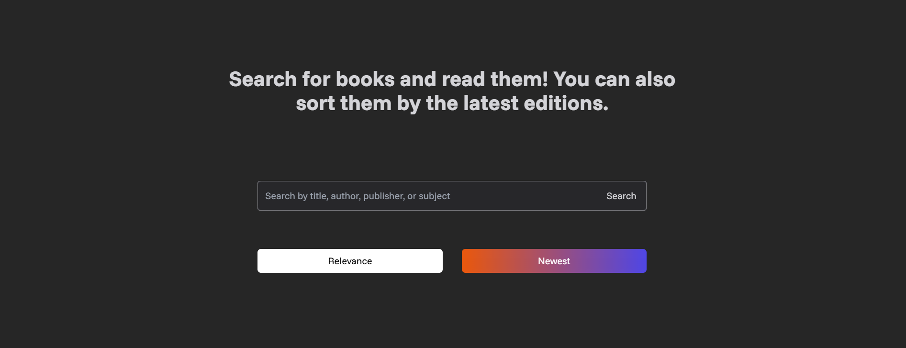

## SEACH-BOOK 🔎📙
Books can be searched using various criteria, including title, author, publisher, subject, ISBN, LCCN, and OCLC. Furthermore, search results can be refined to display the most recent editions. Upon identifying a desired book, you may access its detailed information by selecting it.



### Development Documentation

Installing dependencies:

```bash
npm install
# and
npm run dev
```

### Technologies:
1. TypeScript
2. Next.js
3. Google Books API

🌐 <a href="https://search-gbook.vercel.app/">Link</a>
